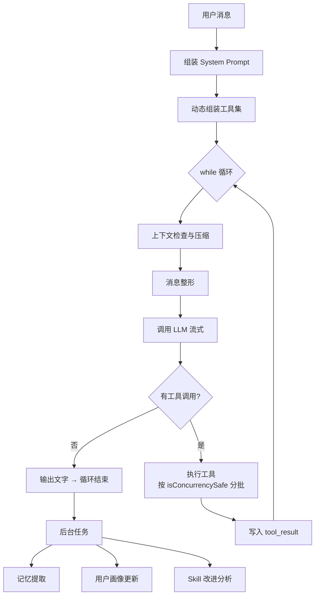
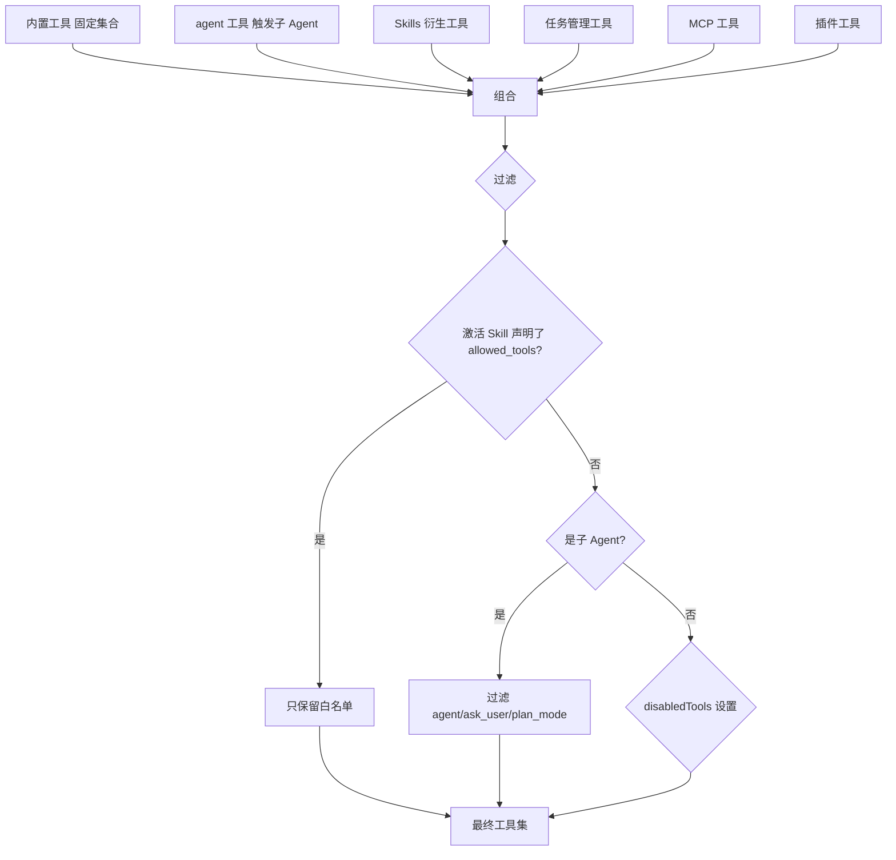
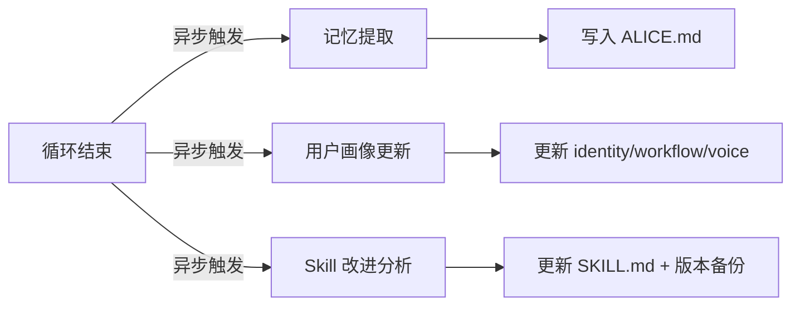

# 第三章：Agent 主循环

> Anthropic 说"一个简单的 while 循环"。实际上，这个循环里住着整个系统的灵魂。

---

## 设计动机：从最简单的循环开始

Agent Loop 的最简形式只有六行：

```python
while True:
    response = llm.call(messages)
    if not response.tool_calls:
        break
    results = execute_tools(response.tool_calls)
    messages.append(response)
    messages.append(tool_results(results))
```

Anthropic 的说法是对的：**这就是核心**。

但从这六行到生产可用，中间有一条很长的工程路。每一处改动背后都有一个现实问题驱动。

---

## 与 Anthropic 官方的共识与分歧

**参考文章：** [Building Effective Agents](https://www.anthropic.com/research/building-effective-agents)（Anthropic，2024.12）

Anthropic 在这篇文章里把 Agent 描述为：

> *"LLMs using tools based on environmental feedback in a loop."*

这是本质上的正确抽象。Alice 的实现完全认同这个核心模型。

但 Anthropic 的文章聚焦于**何时用 Agent、如何设计工具接口**，对 Agent Loop 内部的状态管理讲得比较少。我们在工程实践中遇到的很多真实问题，恰恰发生在"循环内部"。

**主要分歧点及其背后的工程逻辑：**

| 问题 | Anthropic 建议 | Alice 的做法 | 为什么这样选择 |
|------|--------------|------------|-------------|
| 工具调用时的文字说明 | 透明展示 planning steps | 丢弃 tool_call 伴随文字 | 规划文字对下一轮推理贡献极小，却显著占用 token；在 50 轮的长任务中，积累的规划文字可以浪费 30%+ 的上下文 |
| 上下文管理 | 建议简化消息历史 | 四层压缩（Snip/MicroCompact/Collapse/AutoCompact） | 不同类型的消息价值密度差异很大，应该用不同成本的策略处理 |
| 系统 Prompt | 静态注入为主 | 动态组装，KV Cache 优先 | LLM API 的 KV Cache 机制要求 prompt 前缀稳定，动态内容放在末尾可以大幅降低 API 成本 |
| 循环终止 | 最大迭代次数 | 50 轮 + AbortSignal + 不可恢复错误 | 纯迭代次数不够：用户随时取消的需求需要 AbortSignal；某些错误无法通过重试解决需要立即终止 |

**关于"丢弃规划文字"的深层思考：**

Anthropic 建议透明展示 planning steps，出发点是"让 Agent 的推理过程可观察"。这个目标是对的，但实现方式可以分离：把 planning steps 记录到日志（Debug 面板），对用户展示；从消息历史里删掉，不送给下一轮 LLM。可观察性和 token 效率可以同时满足。

---

## Agent Loop 全景



---

## 循环的入口与出口

Agent 循环的**入口**：用户消息（文字，可选图片）+ 历史上下文 + 配置参数。

Agent 循环的**出口**：一个事件流（AsyncGenerator），持续发射：
- 文字 token（流式）
- 推理内容（如果模型支持 CoT）
- 工具开始执行 / 工具执行完成（含结果）
- 上下文压缩发生
- Token 用量统计
- 完成

出口设计为事件流有几个原因：
1. 用户体验更好（看到流式输出）
2. 支持长时间任务（工具执行可能需要几秒甚至几十秒）
3. 便于中途取消（`AbortSignal`）

---

## 循环前的准备：System Prompt 组装

进入 while 循环之前，先组装 System Prompt。这是有优先级的多层叠加：

```
优先级（从高到低）：

1. 外部传入的 systemPrompt 参数（完全覆盖）
2. 用户自定义系统提示文件（覆盖默认）
3. 热更新内容（服务端动态下发）
4. 内置默认模板
```

**系统提示的内容结构**（按注入顺序）：


每次对话时，System Prompt 前缀是静态的，对 LLM 的 KV Cache 友好。**动态内容**（当前日期、权限拒绝摘要）追加在最后，不破坏前缀的缓存命中。

> **Anthropic 的思路对比：** Anthropic 在 [Effective Context Engineering](https://www.anthropic.com/engineering/effective-context-engineering-for-ai-agents) 中强调"只在需要时才注入信息"。Alice 的分层注入和 KV Cache 优先策略正是这一思路的具体实现。

---

## 动态工具集：每次循环重新计算

工具列表不是固定的，每次循环开始时动态组装：



**为什么工具集要动态计算？**

同一个 Alice 实例，在不同的 Skill 场景下、不同的 Agent 角色下、不同的用户设置下，应该暴露给 LLM 不同的工具集。静态工具列表无法满足这个需求。

> **Anthropic 的思路：** *"Tool definitions and specifications should be given just as much prompt engineering attention as your overall prompts."* Alice 的工具白名单机制是这一原则的进一步落地：不只写好文档，还要控制工具可见性。

---

## while 循环的内部结构

每一轮迭代：

### 步骤 1：上下文检查与压缩

检查当前消息序列的 token 估算值是否超过阈值，按需触发压缩。详见第五章。

### 步骤 2：消息整形

在发给 LLM 之前，做两件防御性的事：

1. **修复孤立的 tool_call**：如果上一轮有 tool_call 没有对应的 tool_result（可能由中断产生），注入一条合成的错误 tool_result，防止某些模型收到 400 错误

2. **注入动态内容**：把当前日期、权限拒绝摘要追加到最后一条 system 消息末尾（不放在开头，保护 KV Cache）

### 步骤 3：调用 LLM 流式

```mermaid
sequenceDiagram
    participant Loop as Agent Loop
    participant LLM as LLM API
    participant UI as UI 渲染层

    Loop->>LLM: 发送 messages + tools（流式）
    LLM-->>Loop: text chunk（持续）
    Loop-->>UI: yield TextEvent
    LLM-->>Loop: tool_call_delta（持续）
    Loop->>Loop: 累积 JSON
    LLM-->>Loop: tool_call complete
    Loop->>Loop: 记录工具调用
    LLM-->>Loop: done + usage
```

**特殊情况**：如果收到上下文长度超限错误，尝试做一次紧急 collapse（深度压缩），然后重试。

### 步骤 4：写入 assistant 消息

有一个微妙的设计：如果这轮有工具调用，**丢弃伴随的文字内容**，只保留工具调用。

原因：某些模型在发起工具调用时会附带"我来看一下…"这样的说明文字，但这段文字在后续对话中没有用，还会浪费 token。让模型"先行动后解释"，比"边解释边行动"效率更高。

> **Anthropic 的原则差异：** Anthropic 建议"explicitly showing the agent's planning steps"。这是透明度优先的思路。Alice 选择丢弃的原因是：规划文字对下一轮的 LLM 推理贡献极小，却显著占用 token。在长任务中，这是一个重要的工程权衡。

### 步骤 5：无工具调用则退出

如果这一轮 LLM 没有发起任何工具调用，说明它认为任务已完成（或需要等待用户输入），循环结束。

### 步骤 6：执行工具（有工具时）

按 `isConcurrencySafe` 属性分批执行，详见第四章。

执行结果写回上下文，进入下一轮迭代。

---

## 循环的终止条件

循环在以下情况终止：

1. LLM 没有发起工具调用（正常完成）
2. 达到最大迭代次数（默认 50 轮，防无限循环）
3. 接收到 AbortSignal（用户取消）
4. 发生不可恢复的错误

---

## 收尾：后台任务



这三个任务都是 fire-and-forget，不等待它们完成，不让它们影响用户看到响应的速度。

这也是 Alice "越用越懂你" 的底层机制。

---

## 渠道 Fallback：防止"忘记发送"

当对话来自外部渠道（如微信、Telegram）时，AI 应该主动调用"发送到渠道"工具把回复发出去。

但如果 AI 生成了文字回复，却忘记调用发送工具怎么办？

一个简单的防呆机制：循环结束后，检查是否调用过发送工具。如果没有，但有文字输出，自动补一次发送工具调用。

这类"防呆机制"在 Agent 系统里非常重要，不能假设模型总是记得做每一件事。

---

## 为什么选择 AsyncGenerator

Agent 循环的函数签名设计为 `async *run(): AsyncGenerator<AgentEvent>`，而不是回调或 EventEmitter，有几个深层原因：

**背压**：UI 渲染慢时，`generator.next()` 的 await 自然形成背压，不会让事件在内存里积压。

**可取消**：调用方执行 `generator.return()` 即可干净终止，不需要额外的取消机制。

**可组合**：可以把多个 generator 组合（比如子 Agent 的事件流 merge 进父 Agent 的流）。

**类型安全**：TypeScript 能完整推断 `AgentEvent` 的类型，UI 层消费时有完整的类型提示。

---

*上一章：[整体架构](02-architecture.md) · 下一章：[工具系统](04-tool-system.md)*
