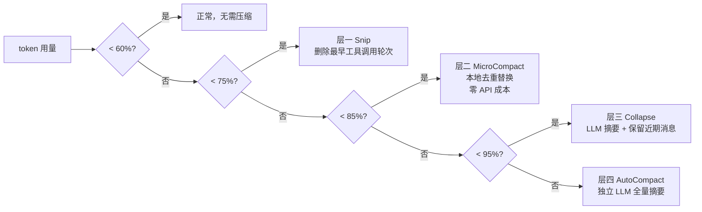
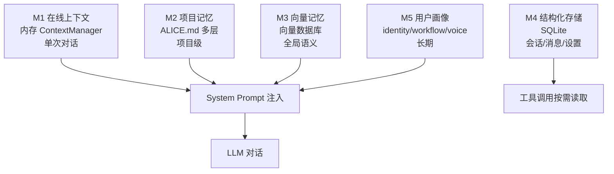

# 第五章：上下文与记忆

> "上下文焦虑"是 Agent 产品的核心难题，但业内的解法差距悬殊。

---

## 为什么这是个难题：设计动机

LLM 有一个本质限制：它不记事。每一次对话调用都是无状态的，上下文窗口就是它的"短期记忆"，一旦关闭，什么都不剩。

但用户期待的 Agent 是"记得你"的那种。这个矛盾，是所有 Agent 产品必须正面解决的工程问题。

有两个相互独立的子问题：

**上下文管理**：解决"当前这次对话的信息放不下"的问题。工具：压缩、截断、摘要。

**记忆系统**：解决"上次对话的重要信息怎么带到这次对话"的问题。工具：持久化存储、检索、注入。

这两个问题的解法完全不同，必须分开设计，分开解决。很多工程团队踩的坑，恰恰是把它们混为一谈。

---

## 与 Anthropic 官方的共识与分歧

**参考文章：** [Effective Context Engineering for AI Agents](https://www.anthropic.com/engineering/effective-context-engineering-for-ai-agents)（Anthropic）

Anthropic 的核心立场：只在需要的时候把信息装进上下文，不需要的时候移除。

Alice 完全认同这个原则。但 Anthropic 的建议停留在策略层面，Alice 在工程实现上走得更深：四层压缩、五层记忆、向量记忆写入时序控制，都是这一原则的具体落地。

| 问题 | Anthropic 建议 | Alice 的做法 |
|------|--------------|------------|
| 上下文太长 | 简化历史消息 | 四层分级压缩（按 token 用量触发不同策略） |
| 跨会话记忆 | 外部存储检索注入 | 五层记忆体系，ALICE.md + 向量库 + 用户画像 |
| 信息注入时机 | 按需加载 | 向量记忆在对话结束后才写入（防循环） |

---

## 第一部分：上下文管理

### 业内常见方案对比

处理上下文溢出，业内有以下几种主流思路：

| 方案 | 代表实现 | 核心逻辑 | 优点 | 缺点 |
|------|---------|---------|------|------|
| **滑动窗口截断** | 大多数基础框架 | 超出 token 限制时删掉最旧的消息 | 实现简单，零成本 | 可能删掉最关键的任务说明（开头） |
| **固定摘要** | LangChain ConversationSummaryMemory | 定期用 LLM 对历史做摘要替换 | 保留语义，损耗低 | 每次摘要有 API 成本；摘要质量不稳定 |
| **RAG 检索注入** | MemGPT、Mem0 | 把历史向量化，每轮按相关性检索 | 理论上无限长记忆 | 检索延迟高；不相关内容也可能被召回 |
| **分层压缩** | Claude Code、Alice | 按 token 用量分级触发不同强度的压缩 | 兼顾成本与质量；早期轮次代价小 | 实现复杂；需要精心调整触发阈值 |
| **外部状态机** | LangGraph | 显式管理对话状态，不依赖消息历史 | 结构清晰可控 | 适合有限状态 workflow，不适合开放式对话 |

**Alice 为什么选择分层压缩，而非简单摘要？**

简单摘要有一个根本缺陷：它把所有历史消息一视同仁。但实际上，一次对话里消息的价值是严重不均匀的：

- 第一条消息（任务说明）：极高价值，绝对不能丢
- 工具执行结果：中等价值，结果本身重要，但详细过程可以压缩
- 重复的搜索/读取调用：低价值，可以去重替换

分层压缩的核心思想是：**根据消息的价值密度，选择对应成本的压缩策略**。

### 为什么不能简单截断

最简单的处理方式：当上下文超出 token 限制时，删掉最旧的几条消息。

问题：
- 可能删掉关键的任务说明（在最开始）
- 可能删掉重要的中间结果（工具执行的输出）
- 模型失去上下文，开始重复已完成的工作

### 四层压缩策略

按上下文使用率从低到高，依次触发更重量级的处理：



**层一：Snip（~60% 阈值）**

最轻量，成本最低：删除最早的几对工具调用轮次（`tool_call` + `tool_result`）。

适用：对话早期的探索性工具调用，它们的结果已经被后续消息引用，原始结果可以删除。

**层二：MicroCompact（~75% 阈值）**

本地替换，**零 API 成本**：对重复出现的相同工具调用，保留最后一次结果，替换早期的重复调用为一行说明。

适用：多次读取同一文件、多次执行相同命令、多次搜索相似关键词。

这是大多数框架没有的优化：它不需要 LLM，完全靠规则，对重复工具调用场景效果显著。

**层三：Collapse（~85% 阈值）**

调用 LLM 做摘要，保留结构：把早期的对话压缩为"结构化状态 + 摘要"，保留最近的 N 条消息保证连贯性。

输出格式：
```
[已压缩历史]
当前任务：xxx
已完成：xxx
当前状态：xxx
下一步：xxx

[保留的最近消息]
...
```

**层四：AutoCompact（~95% 阈值）**

最重量级：用**独立的 LLM 会话**对全量历史做完整摘要，按 9 节结构输出（详见第十四章）。

关键：这个 LLM 调用不能带工具（否则会递归触发压缩），需要用特殊标记防止这个子会话再次触发压缩。

### 压缩策略的互斥问题

**这是一个常被忽视的工程细节。**

多种压缩机制同时触发会产生竞态，相互损坏对方留下的标记。需要用互斥守卫明确防止：
- 压缩子任务本身不触发压缩（防递归）
- 记忆提取任务不触发压缩
- 多个压缩机制不同时进行

每种互斥条件都应该有明确的守卫判断，不能靠"应该不会同时触发"来蒙混。绝大多数开源框架在这个问题上的处理是缺失的。

---

## 第二部分：记忆系统

### 业内主流记忆方案对比

| 方案 | 代表产品 | 存什么 | 检索方式 | 优点 | 缺点 |
|------|---------|-------|---------|------|------|
| **对话历史缓存** | ChatGPT Projects | 完整的历史消息 | 全量注入 | 实现简单，无遗漏 | Token 成本高；历史越长越贵 |
| **向量语义记忆** | MemGPT、Mem0、Zep | 对话的语义摘要 | 相似度检索 | 支持长期记忆；只召回相关内容 | 检索有延迟；可能召回不相关项 |
| **结构化配置文件** | OpenAI 的 Memory | 提炼后的用户事实 | 全量注入 | 精准；无噪声 | 写入策略复杂；边界难定义 |
| **文件系统记忆** | Claude Projects (CLAUDE.md) | 项目级文档 + 约定 | 全量注入 | 透明可编辑；用户可控 | 随着项目增长体积膨胀 |
| **多层混合记忆** | Alice | 五层各司其职 | 按层策略各异 | 灵活；成本可控 | 实现最复杂 |

**各方案的根本取舍：**

向量记忆的核心优势是"无限长"，但它有一个根本问题：**相关性检索依赖向量距离，在某些任务场景下，"语义相关"和"任务相关"并不一致**。比如"帮我写一首诗"这个任务，召回的历史记忆可能是用户提到的某个随机话题，对任务完全无用。

Alice 的解法是：把记忆按类型分层，用户画像（identity/workflow/voice）总是全量注入，因为它们总是相关的；语义向量记忆作为补充，按话题检索。

### 五层记忆架构



不同类型的信息有不同的读写频率和生命周期：

| 层 | 名称 | 位置 | 生命周期 | 存什么 |
|----|------|------|---------|-------|
| M1 | 在线上下文 | 内存（ContextManager）| 单次对话 | 当前工作状态、工具调用历史 |
| M2 | 项目记忆 | 文件系统（ALICE.md）| 项目级 | 约定、规则、重要决策 |
| M3 | 向量记忆 | 向量数据库 | 全局 | 历史对话的语义化存储 |
| M4 | 结构化存储 | SQLite | 持久化 | 会话列表、消息历史、设置 |
| M5 | 用户画像 | 文件（memory/*.md）| 长期 | 用户身份、偏好、风格 |

### M2：ALICE.md 的层级读取

项目记忆文件按目录层级组织：

```
~/.alice/ALICE.md              ← 全局（跨项目通用知识）
{workdir}/.alice/ALICE.md      ← 项目级（该项目的约定）
{workdir}/subdir/.alice/ALICE.md ← 子目录（更细粒度规则）
```

读取时合并所有层级，越深层的规则优先级越高（类似 CSS 的层叠）。

这个设计直接来自 Claude Projects 的 `CLAUDE.md` 机制，但 Alice 的多层覆盖是额外的工程实现。大多数框架只支持单一项目级记忆文件。

### M3：向量记忆的写入时机

**一个常见的工程陷阱**：对话进行中产生的消息，不能立即写入向量库。

原因：如果写了，下一轮检索会把"刚刚生成的内容"当作历史记忆召回，产生信息自我强化循环：AI 会反复把自己刚说过的话当"历史记忆"再说一遍。

正确做法：维护一个写入队列，在整轮对话**结束后**统一 flush 到向量库。

这个时序问题，在 Mem0、Zep 等专门的记忆库的文档里鲜有提及，但在实际工程中是一个必须处理的边界条件。

### M5：用户画像的三个维度

用户画像分三个独立文件维护：

- **identity.md**：用户是谁（职业、领域、技术栈偏好）
- **workflow.md**：用户怎么工作（任务流程、工作习惯、常用工具）
- **voice.md**：用户怎么沟通（语气风格、详细程度偏好、反馈方式）

**为什么三个分开，而不是一个文件？**

更新粒度不同：工作流偏好可能隔几周才变一次；沟通风格在一次对话后就可能更新。分开维护可以独立更新，不会因为更新一个而覆盖另外两个。

OpenAI Memory 的设计是一个扁平的"用户事实列表"，没有维度区分。Alice 的三维设计让每个维度的读写逻辑和提取模型都可以独立优化。

### 记忆提取的边界判断

记忆提取的关键问题：**什么该存，什么不该存。**

**应该存的**：
- 项目的特殊约定（"这个项目的 API 都在 /services 目录下"）
- 非显而易见的设计决策（"用了 X 方案，原因是..."）
- 曾经踩过的坑（"不要用这个库的 v2，有已知 bug"）

**不应该存的**：
- 可以从代码文件直接查到的信息（重复且会过期）
- 临时性的任务状态（"正在处理第三步"）
- AI 自己的人格和指令（这是 System Prompt 的职责）
- 个人隐私信息（这是用户画像的职责）

记忆应该是**"添加了就一直有用"**的知识，不是事件日志。

---

## 上下文工程的本质

上下文工程的核心是**"什么时候装什么"**，而非单纯追求"装多少进去"。

| 层 | 何时读入 | 读入方式 | 成本 |
|----|---------|---------|------|
| M1 在线上下文 | 始终在线 | 直接在消息序列里 | 随对话增长 |
| M2 项目记忆 | 每次对话开始时 | 注入 System Prompt | 固定（项目文件大小） |
| M3 向量记忆 | 每次对话开始时 | 按语义相关性检索 | 检索 API + 召回 token |
| M4 结构化存储 | 按需查询 | 工具调用 | 按查询频率 |
| M5 用户画像 | 每次对话开始时 | 注入 System Prompt | 固定（画像文件大小） |

五层记忆的读写频率、存储位置、生命周期完全不同，这是有意为之的分工。每一层都是针对一类特定问题的最优解，合在一起覆盖了从"本次对话"到"长期积累"的完整时间维度。

---

*上一章：[工具系统](04-tool-system.md) · 下一章：[多 Agent 协作](06-multi-agent.md)*
