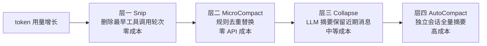
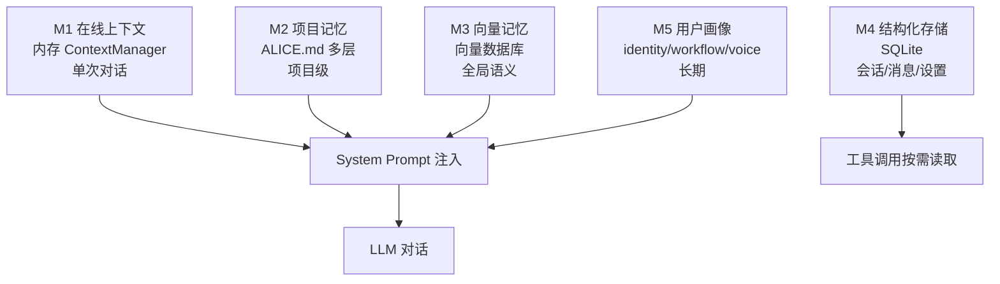

# 第五章：上下文与记忆

> "上下文焦虑"是 Agent 产品的核心难题，但业内的解法差距悬殊。

---

## 为什么这是个难题：设计动机

LLM 有一个本质限制：它不记事。每一次对话调用都是无状态的，上下文窗口就是它的"短期记忆"，一旦关闭，什么都不剩。

但用户期待的 Agent 是"记得你"的那种。这个矛盾，是所有 Agent 产品必须正面解决的工程问题。

有两个相互独立的子问题：

**上下文管理**：解决"当前这次对话的信息放不下"的问题。工具：压缩、截断、摘要。

**记忆系统**：解决"上次对话的重要信息怎么带到这次对话"的问题。工具：持久化存储、检索、注入。

这两个问题的解法完全不同，必须分开设计，分开解决。很多工程团队踩的坑，恰恰是把它们混为一谈。

---

## 与 Anthropic 官方的共识与分歧

**参考文章：** [Effective Context Engineering for AI Agents](https://www.anthropic.com/engineering/effective-context-engineering-for-ai-agents)（Anthropic）

Anthropic 的核心立场：只在需要的时候把信息装进上下文，不需要的时候移除。

Alice 完全认同这个原则。但 Anthropic 的建议停留在策略层面，Alice 在工程实现上走得更深：四层压缩、五层记忆、向量记忆写入时序控制，都是这一原则的具体落地。

| 问题 | Anthropic 建议 | Alice 的做法 |
|------|--------------|------------|
| 上下文太长 | 简化历史消息 | 四层分级压缩（按 token 用量触发不同策略） |
| 跨会话记忆 | 外部存储检索注入 | 五层记忆体系，ALICE.md + 向量库 + 用户画像 |
| 信息注入时机 | 按需加载 | 向量记忆在对话结束后才写入（防循环） |

---

## 第一部分：上下文管理

### 业内常见方案对比

处理上下文溢出，业内有以下几种主流思路：

| 方案 | 代表实现 | 核心逻辑 | 优点 | 缺点 |
|------|---------|---------|------|------|
| **滑动窗口截断** | 大多数基础框架 | 超出 token 限制时删掉最旧的消息 | 实现简单，零成本 | 可能删掉最关键的任务说明（开头） |
| **固定摘要** | LangChain ConversationSummaryMemory | 定期用 LLM 对历史做摘要替换 | 保留语义，损耗低 | 每次摘要有 API 成本；摘要质量不稳定 |
| **RAG 检索注入** | MemGPT、Mem0 | 把历史向量化，每轮按相关性检索 | 理论上无限长记忆 | 检索延迟高；不相关内容也可能被召回 |
| **分层压缩** | Claude Code、Alice | 按 token 用量分级触发不同强度的压缩 | 兼顾成本与质量；早期轮次代价小 | 实现复杂；需要精心调整触发阈值 |
| **外部状态机** | LangGraph | 显式管理对话状态，不依赖消息历史 | 结构清晰可控 | 适合有限状态 workflow，不适合开放式对话 |

**Alice 为什么选择分层压缩，而非简单摘要？**

这个问题值得仔细想。简单摘要并非没有优点——它实现简单，一次 LLM 调用就能把长历史压缩成紧凑的摘要，很多框架的早期版本都是这么做的。

问题在于：**简单摘要把所有历史消息一视同仁，而实际上消息的价值差异极大**。

第一条消息（任务说明）包含了用户的核心意图，是整个任务的锚点，压缩或丢失它几乎必然导致后续偏航。但重复的文件读取、相同查询的多次搜索，它们的价值在于"最终结果"，早期的重复执行过程完全可以合并。如果用统一的摘要策略处理这两类消息，摘要质量会非常不稳定——有时候把关键意图摘掉了，有时候又花了大量篇幅保留无关紧要的过程。

分层压缩的本质是：**把"什么该删"和"用什么方式删"这两个问题分开解决**，而不是交给一次 LLM 调用统一处理。轻量的规则性删除（去重、截断早期探索）完全不需要 LLM，成本为零；只有真正需要语义理解的压缩，才调用 LLM，而且调用时已经知道要压缩的是什么类型的内容。

当然，这个选择有代价：实现复杂度高，触发逻辑需要持续调整。如果你的产品是短会话为主、用户很少连续执行几十轮工具调用，简单摘要完全够用，没有必要上分层压缩。

### 为什么不能简单截断

最简单的处理方式：当上下文超出 token 限制时，删掉最旧的几条消息。

问题：
- 可能删掉关键的任务说明（在最开始）
- 可能删掉重要的中间结果（工具执行的输出）
- 模型失去上下文，开始重复已完成的工作

### 四层压缩策略

按上下文使用率从低到高，依次触发更重量级的处理：

**层一：Snip**

最轻量，成本最低：删除最早的几对工具调用轮次。

核心判断依据：对话早期的探索性工具调用，它们的结果通常已经被后续消息引用，原始记录可以删除。但如果任务说明本身在早期消息里，Snip 一定不能碰它——这是实现时需要特别保护的边界。

**层二：MicroCompact**

本地替换，**零 API 成本**：对重复出现的相同工具调用，保留最后一次结果，替换早期重复调用为一行简短说明。

适用场景非常具体：多次读取同一文件、多次执行相同命令、多次搜索相似关键词。这个场景比想象中普遍——Agent 在长任务中经常需要反复确认某个文件的当前状态。这一层完全不依赖 LLM，是纯规则的，这也意味着它的压缩效果是可预测的，不会因为 LLM 摘要质量波动而不稳定。

**层三：Collapse**

调用 LLM 做摘要，保留近期消息的完整性。这一层的关键设计判断是：**保留什么，而不是压缩什么**。近期的几条消息保持原样，因为它们代表当前任务状态；只有更早的历史被摘要替换。

摘要的输出应该是结构化的——不是自由文本，而是"当前任务、已完成步骤、当前状态、下一步"这样的框架。原因是：结构化摘要在下一轮 LLM 推理时，比自由文本摘要更容易被正确解读。

**层四：AutoCompact**

最重量级，用**独立的 LLM 会话**对全量历史做完整摘要。

这一层有一个必须处理的递归陷阱：执行摘要的 LLM 会话本身也是一个 Agent 调用，它如果带着工具执行，就可能再次触发压缩逻辑，进入无限递归。必须在调用这个摘要会话时明确禁用工具，并标记当前处于压缩状态，防止任何嵌套压缩触发。

### 压缩策略的互斥问题

**这是一个容易被忽视、但在生产环境里必然会踩的问题。**

多层压缩机制同时存在时，会出现一个奇怪的情况：多个压缩任务可能同时被触发，它们各自留下标记、各自修改消息序列，互相覆盖对方的结果。

更危险的是递归：AutoCompact 会发起一个新的 LLM 调用，这个调用本身会产生新的对话上下文，如果没有特别处理，它会再次触发压缩，进入死循环。同样的问题也存在于记忆提取任务——它也是一个 LLM 调用，同样可能被识别为"需要压缩的上下文"。

解决方案是明确的互斥守卫：在进入每种压缩逻辑时先检查当前是否已在压缩状态，是则直接跳过。这个检查不能是"凭感觉不会同时触发"，必须是代码级的显式判断。

之所以特别提这个问题，是因为它在单次测试时几乎不会出现——你需要同时有多个长任务在运行、或者连续触发 AutoCompact，才能稳定复现。但一旦出现，症状很奇怪（摘要内容错乱、消息序列被破坏），很难定位根因。

---

## 第二部分：记忆系统

### 业内主流记忆方案对比

| 方案 | 代表产品 | 存什么 | 检索方式 | 优点 | 缺点 |
|------|---------|-------|---------|------|------|
| **对话历史缓存** | ChatGPT Projects | 完整的历史消息 | 全量注入 | 实现简单，无遗漏 | Token 成本高；历史越长越贵 |
| **向量语义记忆** | MemGPT、Mem0、Zep | 对话的语义摘要 | 相似度检索 | 支持长期记忆；只召回相关内容 | 检索有延迟；可能召回不相关项 |
| **结构化配置文件** | OpenAI 的 Memory | 提炼后的用户事实 | 全量注入 | 精准；无噪声 | 写入策略复杂；边界难定义 |
| **文件系统记忆** | Claude Projects (CLAUDE.md) | 项目级文档 + 约定 | 全量注入 | 透明可编辑；用户可控 | 随着项目增长体积膨胀 |
| **多层混合记忆** | Alice | 五层各司其职 | 按层策略各异 | 灵活；成本可控 | 实现最复杂 |

**各方案的根本取舍：**

每种方案都有它真正擅长的场景。

结构化配置文件（如 OpenAI Memory）适合"精准事实"：用户有几个孩子、用什么编程语言、住在哪个城市。这类信息量小、更新频率低、相关性几乎是全局的，全量注入完全可行，也不会产生噪声。

向量语义记忆适合"海量历史"：用过几百次对话，某次说了一件重要的事，现在需要召回。全量注入早已不可能，向量检索是唯一路径。但它有一个根本弱点：**"语义相关"和"任务相关"并不总是一致**。用户说"帮我写一份周报"，向量检索可能召回几条关于"周末"的旧对话，因为语义空间里它们挨在一起。

文件系统记忆（CLAUDE.md 类）适合"项目级约定"：这个项目用什么规范、有什么特殊约定、踩过什么坑。这类信息的特点是需要人工维护、透明可编辑，用户对它有控制权。

Alice 的五层设计不是"一种方案打败所有方案"，而是**每种类型的信息用最适合它的存储和检索方式**。用户画像总是全量注入，因为它总是相关的；向量记忆按语义检索作为补充；项目记忆以文件形式可编辑可追溯。

### 五层记忆架构

不同类型的信息有不同的读写频率和生命周期：

| 层 | 名称 | 位置 | 生命周期 | 存什么 |
|----|------|------|---------|-------|
| M1 | 在线上下文 | 内存（ContextManager）| 单次对话 | 当前工作状态、工具调用历史 |
| M2 | 项目记忆 | 文件系统（ALICE.md）| 项目级 | 约定、规则、重要决策 |
| M3 | 向量记忆 | 向量数据库 | 全局 | 历史对话的语义化存储 |
| M4 | 结构化存储 | SQLite | 持久化 | 会话列表、消息历史、设置 |
| M5 | 用户画像 | 文件（memory/*.md）| 长期 | 用户身份、偏好、风格 |

### M2：项目记忆的层级读取

项目记忆文件按目录层级组织，从全局到项目到子目录，越深层的规则优先级越高——类似 CSS 的层叠规则。

**为什么要有层级，而不是一个文件？**

不同粒度的约定有不同的适用范围。"始终用中文回复"是全局约定，对所有项目都有效；"这个项目的 API 文档在 /docs 目录"只对当前项目有效；"这个模块的命名规范是 X"只对某个子目录有效。

如果只有一个文件，要么把所有约定都堆在一起（文件越来越臃肿），要么每个项目都要重写全局约定（维护成本高）。层级设计让不同范围的知识各归其位。

这个设计的代价是：层级冲突时的优先级需要用户理解。如果全局文件和项目文件对同一件事有不同说法，系统应该遵循哪个？越具体的规则优先，是一个合理的默认值，但不是所有情况下都符合用户预期。

### M3：向量记忆的写入时机

**一个常见的工程陷阱**：对话进行中产生的消息，不能立即写入向量库。

原因：如果写了，下一轮检索会把"刚刚生成的内容"当作历史记忆召回，产生信息自我强化循环：AI 会反复把自己刚说过的话当"历史记忆"再说一遍。

正确做法：维护一个写入队列，在整轮对话**结束后**统一 flush 到向量库。

这个时序问题，在 Mem0、Zep 等专门的记忆库的文档里鲜有提及，但在实际工程中是一个必须处理的边界条件。

### M5：用户画像的三个维度

用户画像分三个独立文件维护：

- **identity.md**：用户是谁（职业、领域、技术栈偏好）
- **workflow.md**：用户怎么工作（任务流程、工作习惯、常用工具）
- **voice.md**：用户怎么沟通（语气风格、详细程度偏好、反馈方式）

**为什么三个分开，而不是一个文件？**

更新粒度不同：工作流偏好可能隔几周才变一次；沟通风格在一次对话后就可能更新。分开维护可以独立更新，不会因为更新一个而覆盖另外两个。

OpenAI Memory 的设计是一个扁平的"用户事实列表"，没有维度区分。Alice 的三维设计让每个维度的读写逻辑和提取模型都可以独立优化。

### 记忆提取的边界判断

记忆提取的关键问题：**什么该存，什么不该存。**

**应该存的**：
- 项目的特殊约定（"这个项目的 API 都在 /services 目录下"）
- 非显而易见的设计决策（"用了 X 方案，原因是..."）
- 曾经踩过的坑（"不要用这个库的 v2，有已知 bug"）

**不应该存的**：
- 可以从代码文件直接查到的信息（重复且会过期）
- 临时性的任务状态（"正在处理第三步"）
- AI 自己的人格和指令（这是 System Prompt 的职责）
- 个人隐私信息（这是用户画像的职责）

记忆应该是**"添加了就一直有用"**的知识，不是事件日志。

---

## 上下文工程的本质

上下文工程的核心是**"什么时候装什么"**，而非单纯追求"装多少进去"。

| 层 | 何时读入 | 读入方式 | 成本 |
|----|---------|---------|------|
| M1 在线上下文 | 始终在线 | 直接在消息序列里 | 随对话增长 |
| M2 项目记忆 | 每次对话开始时 | 注入 System Prompt | 固定（项目文件大小） |
| M3 向量记忆 | 每次对话开始时 | 按语义相关性检索 | 检索 API + 召回 token |
| M4 结构化存储 | 按需查询 | 工具调用 | 按查询频率 |
| M5 用户画像 | 每次对话开始时 | 注入 System Prompt | 固定（画像文件大小） |

五层记忆的读写频率、存储位置、生命周期完全不同，这是有意为之的分工。

**上下文工程的核心判断是：信息的价值随时间和场景而变化，没有一种存储方式对所有类型的信息都最优。** 把不同的信息放进同一种存储里，要么成本高（全量注入了大量无关内容），要么召回差（用向量检索精准的结构化事实）。

层次越多，维护成本越高——这是真实的代价。对于一个小产品或者短会话场景，三层甚至两层可能就足够了。加层的前提是：你确实遇到了某类信息用现有层次处理不好的问题，而不是"架构上看起来更完整"。

---

*上一章：[工具系统](04-tool-system.md) · 下一章：[多 Agent 协作](06-multi-agent.md)*
