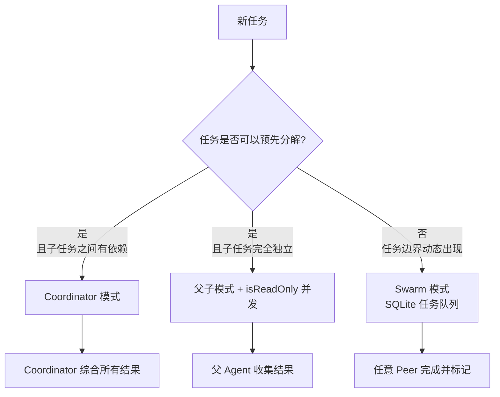

# 第六章：多 Agent 协作

> 一个 Agent 看世界是串行的，多个 Agent 可以并行感知。但更关键的问题是：信息如何流动。

---

## 设计动机：为什么不用一个更大的 Agent

很多团队第一个想法是：既然上下文窗口是限制，那就用更长上下文的模型，问题不就解决了？

这个想法在某些场景下确实是对的。如果任务本身是串行的、需要持续积累上下文才能完成，一个大上下文的单 Agent 可能比多个小 Agent 更可靠——因为多 Agent 引入了协调成本，而协调本身是出错的地方。

**但有两类问题，更大的上下文解决不了：**

**问题一：推理质量随上下文增长而下降。** 这不是一个线性关系。当 prompt 超过某个长度，模型的注意力会分散，"lost in the middle"现象（中间部分信息被低权重处理）在多个研究里都有记录。更关键的是，这个退化不是渐进的，而是在某个阈值附近出现明显的质量断崖——在那之前好好的，越过那个点任务开始悄悄出错。

**问题二：并发性是结构性问题，上下文大小解决不了。** 查五个城市的天气、分析十个竞品的官网，这类任务的瓶颈是"需要做很多相互独立的事"，而单 Agent 天然是串行的，一次只能做一件事。上下文窗口再大，也改变不了这个结构——只是每次等待工具执行时 token 更多而已。

所以多 Agent 的决策前提是：**先判断任务是"信息积累型"还是"并发执行型"**。前者往往单 Agent + 好的上下文管理就够；后者才真正需要多 Agent。

---

## 业内主流多 Agent 框架对比

在设计 Alice 的多 Agent 协作模式之前，有必要了解业内的其他思路：

| 框架 | 核心模式 | 通信机制 | 优点 | 局限 |
|------|---------|---------|------|------|
| **CrewAI** | 角色扮演 + 固定流程 | 顺序传递结果 | 直观，适合预定义工作流 | 不支持真正的并发；角色是静态的 |
| **AutoGen（Microsoft）** | 对话驱动，Agent 互相聊天 | 消息总线 | 灵活，可以自然语言协商 | 对话控制复杂；容易陷入无限循环 |
| **LangGraph** | 显式有向图，状态机 | 共享状态对象 | 可视化清晰，流程可控 | 需要预先定义图结构；不适合动态任务 |
| **OpenAI Swarm** | 简单 handoff，Agent 互相移交控制权 | 函数调用 | 极简，概念清晰 | 无持久状态；不支持并发 |
| **Anthropic 多 Agent** | Orchestrator-Workers 模式 | 工具调用结果返回 | 官方推荐，可靠性高 | 框架建议，非完整实现 |
| **Alice** | 父子 + Coordinator + Swarm（三模式） | 工具结果 + SQLite 任务队列 | 适应不同场景；并发安全 | 实现最复杂 |

**各框架的根本分歧点，以及它们各自合理的场景：**

**共享状态 vs 消息传递**：LangGraph 用共享状态对象，所有 Agent 读写同一份数据结构，好处是信息流非常直接，坏处是并发写入的竞态问题需要显式处理，调试时也难以确定某个状态是哪个 Agent 写入的。消息传递（工具结果返回）让每个 Agent 的输出是独立的、可追溯的，代价是信息必须显式传递，无法直接访问其他 Agent 的"当前状态"。如果你的多 Agent 任务需要频繁的状态共享和协商，消息传递会让代码很繁琐；如果任务可以清晰分解成独立子任务，消息传递的可追溯性会让调试容易很多。

**预定义流程 vs 动态分解**：CrewAI 这类框架需要在代码里预先定义 Agent 角色和任务流程，适合流程固定、可以用代码显式描述的场景（比如内容生产流水线）。动态分解让 Coordinator 在运行时根据任务内容决定分解方式，适合任务结构事先无法确定的场景，但同时也让流程更难以审计和复现。

**中心化 vs 去中心化**：中心化 Coordinator 是单点，既是它的优势（全局视野，易于综合决策），也是它的风险（单点失败）。去中心化 Swarm 天然容错，但协调靠任务队列和依赖声明，对任务设计的要求更高——你需要把任务的依赖关系提前想清楚，否则执行顺序会出问题。

## 为什么需要多 Agent

单个 Agent 有两个天然限制：

**限制一：上下文窗口**。复杂任务（大型代码库分析、多文档研究、长流程自动化）会把上下文撑满。把任务分给多个 Agent，每个 Agent 只处理自己的部分，不共享上下文。

**限制二：串行执行**。Agent 一次只能做一件事，任务之间需要等待。并行的独立子任务（五个城市的天气调研、十个文档的摘要提取）如果能并发执行，效率可以数倍提升。

多 Agent 的本质是：**把任务分解为可独立处理的子任务，分配给独立的 Agent 实例**。

---

## 三种协作模式

### 模式一：父子（Subagent）

最简单的模式。父 Agent 在执行过程中，通过 `agent` 工具创建子 Agent：

```
父 Agent 的 tool_call:
  agent(prompt="分析 competitive-analysis.pdf，总结竞品优劣势")

子 Agent 独立执行
    ↓ 完成后
子 Agent 结果作为 tool_result 返回给父 Agent
```

**关键设计**：`isConcurrencySafe` 由 `isReadOnly` 参数决定。只读的子任务可以并行，写任务需要串行。这让父 Agent 可以通过声明子任务的只读性来控制并发：

```
agent("分析文档 A", isReadOnly=true)   ─┐
agent("分析文档 B", isReadOnly=true)   ─┤ 可以并行
agent("分析文档 C", isReadOnly=true)   ─┘
agent("综合以上结果写报告", isReadOnly=false) → 等前面都完成后串行
```

### 模式二：Coordinator（协调者）

更结构化的模式。专门的 Coordinator Agent 负责任务分解和结果综合，Worker Agent 负责执行：

```
Coordinator 分析任务
    ↓
拆解为多个子任务（带明确的角色、模型、上下文）
    ↓
分发给 Worker（并行或串行）
    ↓
收集所有结果
    ↓
Coordinator 综合，形成最终输出
```

**Coordinator 的系统提示原则**（来自工程实践）：

```
- 优先研究，再行动（先并行收集信息，再综合）
- 读写分离（并行读，串行写）
- 验证用新 Worker（不相信自己，新起一个 Worker 验证）
- 不委托理解（禁止说"based on your findings"，综合的责任在 Coordinator）
```

最后一条尤其重要：Coordinator 不能把综合工作转嫁给子任务。每个 Worker 的输出是独立的，Coordinator 必须自己读取所有输出并综合。

### 模式三：Swarm（群体）

去中心化的多 Agent 协作。没有专门的 Coordinator，多个对等的 Peer 共享一个任务队列，各自领取任务执行：

```
任务队列（SQLite 持久化）
    ↑ 提交任务（含依赖关系）
Coordinator
    ↓ 轮询领取
Peer A ──→ 执行任务 1
Peer B ──→ 执行任务 2
Peer C ──→ 等待任务 3（依赖 1 和 2 完成）
```

**任务领取的并发安全**：

Swarm 的核心工程问题是：多个 Peer 同时轮询任务队列时，如何保证每个任务只被一个 Peer 领取？

这是一个经典的分布式并发问题，解法的本质是"原子性领取"——把"查看任务是否可领取"和"标记为已领取"合并成一个不可分割的操作。如果操作期间任务已经被别人领取，当前操作失败，Peer 重新寻找下一个可领取的任务。

持久化存储（无论是数据库还是文件）在这里是必需的，原因是：Swarm 的任务可能跨越多个会话，某个 Peer 崩溃后，任务应该能被另一个 Peer 重新领取，而不是丢失。这需要状态持久化，不能只存在内存里。

**任务依赖**：

每个任务可以声明它依赖哪些其他任务完成才能开始。这构成了一个有向无环图——任务 C 等待任务 A 和 B，任务 D 等待任务 C，依此类推。

Peer 领取任务时需要先检查依赖是否已满足。这个检查不可省略，否则任务会乱序执行，依赖关系形同虚设。

---

## 子 Agent 的隔离机制

子 Agent 应该尽量与父 Agent 隔离，防止相互影响：

**进程隔离**：子 Agent 最好运行在独立的 Worker Thread（Node.js）或独立进程。这样子 Agent 的内存泄露、异常退出不影响父进程。

**上下文隔离**：子 Agent 有自己的 ContextManager，不与父 Agent 共享上下文。子 Agent 的中间过程（工具调用历史、推理内容）不会出现在父 Agent 的上下文里，只有最终结果会。

**工具隔离**：子 Agent 的工具集是父 Agent 的受限子集（见第四章），防止子 Agent 触发管理类操作。

**降级机制**：如果 Worker Thread 不可用（开发环境、Worker 文件不存在），自动降级到在主线程运行，行为完全等价，只是没有进程隔离。

---

## 权限的向下传递

子 Agent 的权限不能高于父 Agent，这是基本的安全原则。

实现方式：创建子 Agent 时，把当前的权限模式（`permissionMode`）传递给子 Agent。子 Agent 只能继承或降级，不能升级。

当子 Agent 遇到需要用户确认的权限请求时，不能直接弹窗（子 Agent 跑在独立线程，没有 UI 访问权），需要通过消息把请求传回父 Agent，由父 Agent 展示弹窗，用户确认后再把结果传回。

---

## Agent 角色系统

为了让子 Agent 在特定任务上表现更好，可以给不同任务分配专门的角色：

```
researcher  → 优化为信息收集，默认只读
writer      → 优化为内容创作
developer   → 优化为代码编写
analyst     → 优化为数据分析
designer    → 优化为 UI/UX 设计
```

每个角色的区别：
1. **系统提示不同**：更聚焦于该角色的任务特点
2. **默认工具集不同**：researcher 默认有搜索工具；developer 默认有文件编辑工具
3. **并发性不同**：researcher 默认只读可并行；developer 默认非只读需串行

角色不是硬性约束，只是"默认配置"。如果任务需要，可以覆盖角色的默认行为。

---

## 信息流：多 Agent 的核心挑战

多 Agent 系统真正的核心问题是：**信息如何在 Agent 之间流动**，以及谁负责综合决策。

**反模式**：通过共享全局状态传递信息

```
Agent A 写入全局状态
Agent B 写入全局状态  ← 竞态！
Agent C 读取全局状态  ← 可能读到不一致的中间状态
```

**正确模式**：结构化文本返回，Coordinator 负责综合

```
Agent A 返回结构化文本（JSON / Markdown）
Agent B 返回结构化文本
Coordinator 读取两个结果，综合决策
```

每个 Agent 的职责是**"完成任务，返回结果"**，不做超出职责的事（不直接写全局状态、不给其他 Agent 发消息）。

这个原则让系统更容易推理、更容易调试，也让每个子任务可以独立重试。

---

## Alice 三模式的选择逻辑

设计三种协作模式，背后是不同场景的最优解各不相同：



**什么时候用父子模式：** 任务边界清晰、子任务数量事先可知、父 Agent 有足够的上下文处理综合。这是最简单的起点，大多数中等复杂度的任务从这里开始就足够了。过早引入 Coordinator 或 Swarm，反而增加了不必要的协调开销。

**什么时候用 Coordinator：** 任务足够复杂，以至于"如何分解任务"本身就是一个需要推理的问题，不是简单地启动几个并行子任务。或者子任务之间有明确的依赖顺序，需要 Coordinator 管理执行序列。Coordinator 模式的代价是：Coordinator 本身也需要足够的上下文，它不只是一个调度器，它需要真正理解任务才能做好分解和综合。

**什么时候用 Swarm：** 子任务的边界在执行前无法完全确定，任务会动态产生新任务；或者任务需要跨越多个会话持久化进度。Swarm 的复杂性主要来自任务依赖关系的设计——你需要提前想清楚哪些任务必须顺序、哪些可以并发，并把这些关系显式声明出来。如果任务依赖关系复杂但又没有提前想清楚，Swarm 会给你一个看起来在运行但结果错乱的系统。

**一个值得注意的反模式**：三种模式可以嵌套使用，但嵌套层数越深，系统的可观测性越差。一个 Coordinator 内部又有 Coordinator，每一层的日志和错误都需要追溯，调试难度指数级上升。在嵌套之前，先问一句：任务真的不能在更少的层次里解决吗？

---

*上一章：[上下文与记忆](05-context-memory.md) · 下一章：[权限系统](07-permission.md)*
