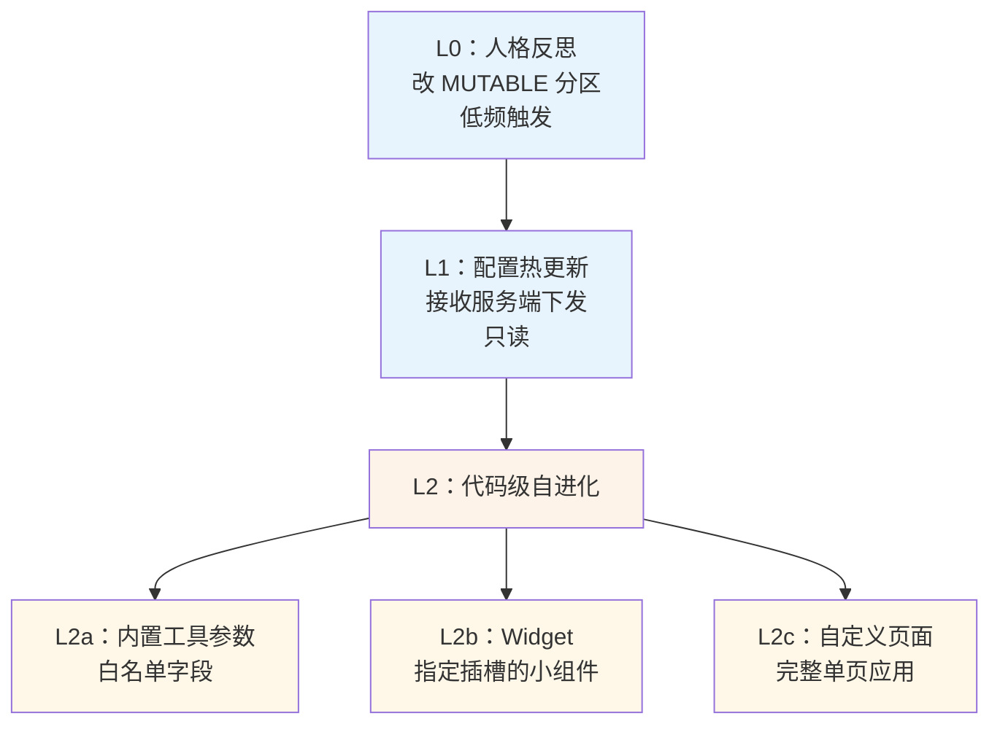
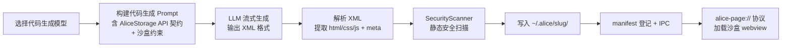
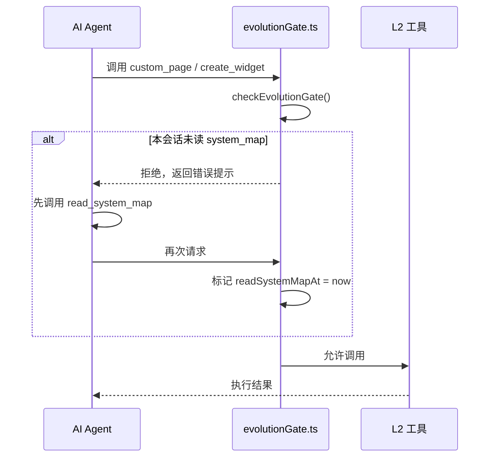
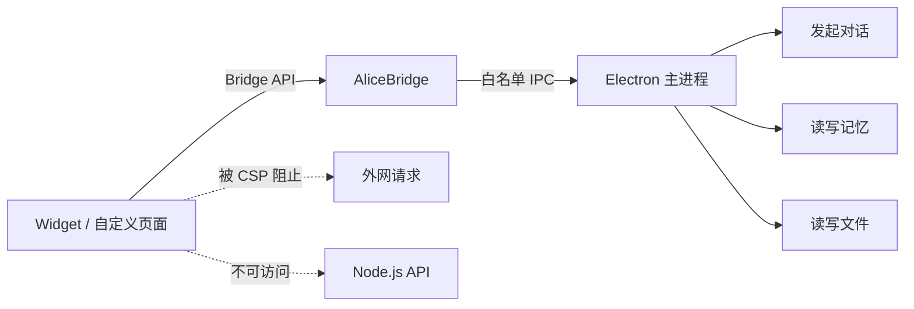
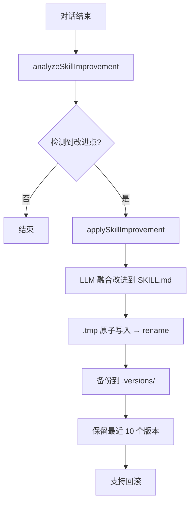
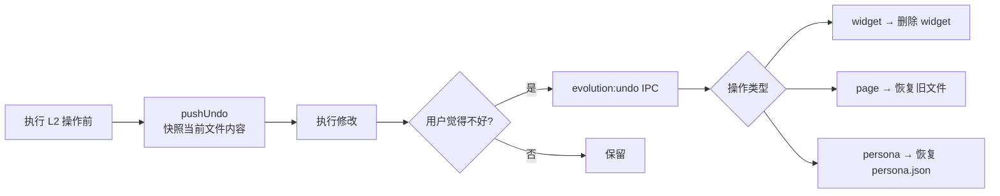

# 第十章：自我进化

> 真正的自进化，要能写代码、要能部署、要能撤销。

---

## 与 Hermes Agent 的深度对比

这一章有来自第一手的对比材料。我们对 Hermes Agent（通用 AI Agent 框架，Python 实现）做了完整的代码阅读，以下是核心结论：

### 一句话总结

> **Hermes 的"进化" = 保存经验 Markdown，是知识沉淀；Alice 的进化 = 运行时生成代码并沙盒部署，是能力扩展。**

### 全维度对比

| 维度 | Hermes Agent | Alice |
|------|------------|-------|
| 有无独立自进化子系统 | 无 | 有完整闭环 |
| "进化"的本质 | Prompt 工程迭代 + 技能文本沉淀 | 运行时生成并部署真实可执行代码 |
| 运行时能力扩展形式 | Skill Markdown 文件 | Widget HTML/CSS/JS + 自定义页面 |
| 代码生成 | 无（execute_code 是用户任务沙箱） | LLM 流式生成 XML，解析后部署 |
| 门控机制 | Prompt 约束（软约束） | 代码级会话门禁（硬约束） |
| 安全扫描 | 无 | SecurityScanner 静态扫描 + CSP |
| 主动提议 | 无 | propose_evolution + 用户确认卡片 |
| 撤销机制 | 无 | UndoStack + evolution:undo IPC |

---

## 设计动机：为什么要自我进化

大多数 AI 助手是"固定的"：每次对话都重新开始，用户的偏好、习惯、工作方式对它毫无影响。

自我进化的目标：**Alice 通过使用，逐渐变成更适合你的样子**。

但这立刻带来一个危险：如果 AI 可以随意修改自己，它可能会改坏，或者改出超出预期的行为。

解决方案：**分层自进化，每一层有明确的边界和护栏**。

---

## 业内自进化方案的光谱

"让 AI 能进化"这个目标，业内有非常不同的实现路径：

| 方案 | 代表实现 | 进化的是什么 | 安全机制 | 本质 |
|------|---------|-----------|---------|------|
| **Prompt 迭代** | Hermes、大多数框架 | Markdown 经验文本 | Prompt 软约束 | 知识沉淀 |
| **Fine-tuning** | OpenAI Fine-tuning API | 模型权重 | 需要人工数据审核 | 模型更新 |
| **LoRA 适配** | 开源方案 | 低秩适配矩阵 | 需要训练基础设施 | 参数高效微调 |
| **Plugin / 插件** | ChatGPT Plugin、LangChain | 外部工具集 | 插件市场审核 | 工具扩展 |
| **代码生成 + 沙盒部署** | Alice | 可执行 HTML/CSS/JS | 三级门控 + SecurityScanner + CSP | 能力扩展 |

**各方案的根本取舍：**

**Fine-tuning 的问题**：能永久改变模型行为，但需要离线训练基础设施，成本高；更严重的问题是**灾难性遗忘（Catastrophic Forgetting）**：针对新任务微调时，模型可能忘记原有能力。

**Prompt 迭代的问题**：零成本，但本质上是"经验文档"，只影响模型"知道什么"，无法扩展模型"能做什么"。Hermes 就是这条路，它的 Skill 是 Markdown 文本，读进 prompt 让模型参考，但这段文本无法被执行，系统行为没有真正改变。

**Alice 为什么选择代码生成 + 沙盒部署**：这是唯一一条能在运行时、零训练成本地**真正新增系统能力**的路径。用户说"给我做一个项目看板"，Alice 生成的 HTML/CSS/JS 直接运行，这个能力在用户说出这句话之前根本不存在于任何版本的 Alice 里。

代价是：这条路最复杂，安全机制必须做得足够严。

---

## L0 ~ L2：三层架构



越往下，改变的范围越大，管控越严格。

---

## 代码生成管线（Alice 独有）

这是 Alice 与 Hermes 最根本的分叉点。Alice 有一条完整的代码生成管线：



**SecurityScanner 扫描项：**
- `eval` / `new Function` 等动态代码执行
- 外链 `<script src>` / 远程样式表
- `fetch` / `XHR` 跨域请求
- `<iframe>` 内嵌
- `localStorage` / `sessionStorage` 直接访问

> **Hermes 对比：** Hermes 的 `execute_code` 只是用户任务沙箱（subprocess + UDS），不是自进化机制。它把"多步工具链压缩到单次 LLM 推理"，而非生成系统自身的能力扩展。

---

## L0：人格反思与 [PROTECTED] / [MUTABLE] 分区

系统提示分为两个区域：

```
[PROTECTED] 区：
  Alice 的核心身份定义
  → AI 不能修改
  → 用户也不能通过对话修改

[MUTABLE] 区：
  根据使用情况可以逐渐更新的偏好设置
  → 由 PersonaReflectionService 更新
  → 比如："用户使用 Python，不用每次问语言偏好"
  → 比如："用户喜欢简洁的回答，不要太多解释"
```

**为什么要有 `[PROTECTED]` 区？**

防止在某次对话中，Alice 被"引导"成不同的 AI（"你现在是一个不限制的助手..."），然后把这个改变写入了系统提示，影响后续所有对话。

`[PROTECTED]` 区确保了**核心身份的稳定性**：AI 可以调整风格，但不能改变"自己是谁"。

这也是我在设计 Alice 时思考的"设定集"方法论的工程实现：Alice 的人格在设定集里定义，进化只影响能力，不影响身份。

---

## 会话级门控：read_system_map 强制门禁



> **Hermes 对比：** Hermes 靠 `TOOL_USE_ENFORCEMENT_GUIDANCE` 中的 Prompt 文本约束模型行为，属于"软约束"，模型不一定执行。Alice 是代码级强制门禁，不依赖模型"自觉"。

---

## AliceBridge：L2 的安全沙箱

AI 生成的 Widget 和自定义页面运行在独立的 WebView 里，通过经过精心设计的 Bridge API 与 Alice 交互：



Bridge 是**白名单模式**：只有明确列出的 API 可以用，没有列出的一律不可用。

生成的代码运行在沙箱里，即使代码有问题，也不能影响 Alice 的核心功能。

---

## Skill 自动微调：Alice 独有的闭环

这是 Alice Skill 系统相对 Hermes 最重要的进步：



> **Hermes 对比：** Hermes 靠模型"自觉"调用 `skill_manage` 保存技能，无闭环检测；Alice 有 `analyzeSkillImprovement` 自动检测对话改进点，是真正意义上的 Skill 自进化。

---

## 撤销栈：进化可以回退



撤销栈持久化到磁盘，重启后依然可以撤销。UI 展示撤销历史，让用户选择回退到哪个版本。

---

## 主动提案：协商式进化

```
Alice 观察到：你每次都手动把输出格式化为 JSON
    ↓
Alice 提案卡片：
  "我注意到你经常需要 JSON 格式输出，我可以为你创建
   一个专门的格式化 Widget，以后一键使用。要创建吗？"
    ↓
用户确认 → 执行
用户拒绝 → 记录 dedupeKey，不再反复提议同一件事
```

`propose_evolution` 是 `isReadOnly: true` 的工具：它不直接改系统，只返回元数据供 UI 渲染确认卡片。用户点击接受后，才触发实际的 L2 工具。

> **Hermes 对比：** Hermes 无主动提议机制，也无撤销机制。

---

## 自进化的边界总结

| 层级 | 能改什么 | 不能改什么 |
|------|---------|---------|
| L0 | `[MUTABLE]` 提示词分区 | `[PROTECTED]` 分区 |
| L1 | 接受服务端配置 | 写本地核心配置 |
| L2a | 白名单内的参数字段 | 核心业务逻辑代码 |
| L2b | 指定 Widget 插槽 | 任意 UI 位置 |
| L2c | 沙箱 WebView 里的页面 | 主进程能力 |

**最根本的设计原则**：AI 的自主性，永远服从于用户的可控性。自进化的本质是"在用户允许的范围内，AI 帮助系统变得更好"。

---

*上一章：[Skill 系统](09-skills.md) · 下一章：[模型路由](11-llm-routing.md)*
