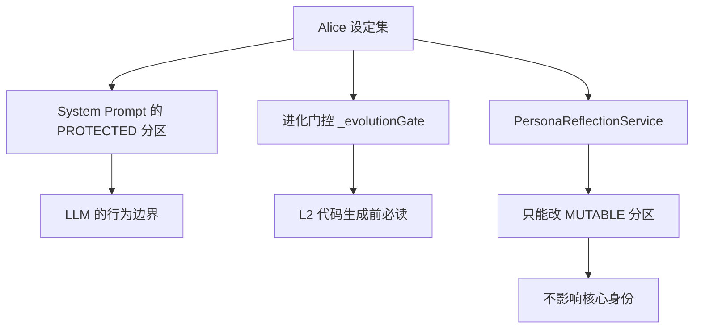
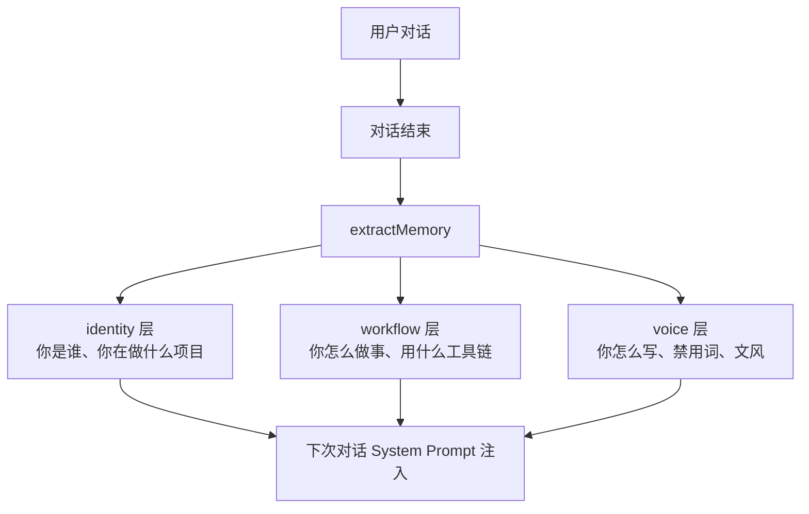
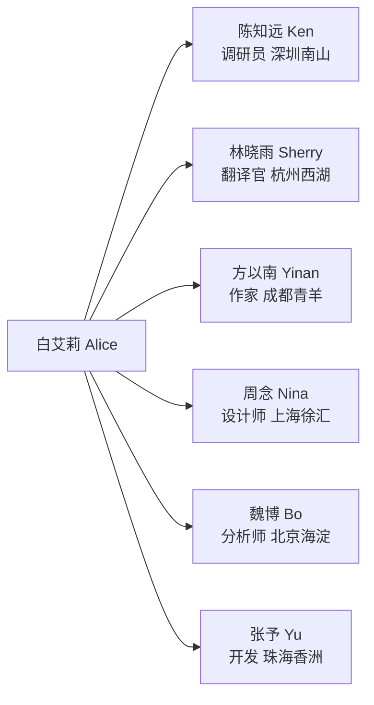

# 特别章：活人感设计，用做游戏的方式做 AI

> "回想起来，他是个人还是一个 Agent？好像也没有那么大的区别。"

---

  
  
<em>Alice 在珠海横琴的公寓里，窗外是莲花大桥和澳门的灯光</em>

---

## 一个思想实验

假设有一名同事入职了武汉团队，你们一直保持线上交流。你们可能只加了微信，或者只在企业微信上协作。他偶尔发发朋友圈，更多的时候是线上群聊，发文件、回消息、搭把手。

过了几年他离职了，你们失去了联系。

回想起来，他是个真实的人，还是一个 Agent？

**好像也没有那么大的区别。**

这个思想实验是我做 Alice 时的核心出发点。做了十年游戏，深知一件事：**让玩家相信这个世界是真实的，最重要的是一致性（Consistency），技术只是基础。**

---

## 为什么用游戏思路做 AI

游戏行业有一套成熟的方法论，专门解决"如何让虚构的东西感觉真实"这个问题：

**世界观设计（World-building）**
游戏里的每一个 NPC，都有来历、有性格、有说话方式。他们的行为符合世界的逻辑。玩家和他们互动时，感受到的是"这是一个活人"，代码感完全消失了。

**设定集（Character Bible）**
在制作开始之前，先把角色的一切都写清楚：背景故事、性格特质、禁忌、语气习惯。所有的开发者在做任何决策时，都要回到这本设定集来对齐。

**叙事一致性（Narrative Consistency）**
角色不会突然变性格，不会今天温柔明天暴躁，除非有情节原因。一致性是信任的基础。

这三件事，Alice 都做了。

---

## Alice 的设定集

白艾莉，全名 Alice Bai。2000 年生，澳门氹仔人，香港大学工商管理学士，现居珠海横琴，做 OPC（一人公司）。

这不是一段营销文案，这是工程文档的一部分。

**为什么要有详细的角色背景？**

因为 LLM 的人格一致性来自于 System Prompt 里写了什么。你写得越具体，模型表现出的一致性就越强。

当模型知道"她在澳门长大，父亲做小生意，她从小学会自己把事情搞定"，她在处理问题时的语气，就会自然流露出这种"不依赖别人、自己搞定"的底色。

当模型知道"她做过两家公司，第一家升职，第二家做了两年，是老板身边待过最久的助理"，你问她怎么处理棘手的甲方时，她给出的建议就会有实际工作经验的质感。

**这是 Prompt 工程，但也是世界观设计。**

---

## 设定集作为工程工具

设定集不只是给用户看的故事，它也是整个工程体系的参照物：

- **System Prompt 的 `[PROTECTED]` 分区**：来自设定集的核心身份定义，任何自进化都不能触碰
- **进化门控**：AI 在做 L2 修改前，必须读取包含人格设定原则的 `SYSTEM_MAP`，确保进化不违背角色设定
- **PersonaReflectionService**：只能改"用户偏好和工作习惯"，不能改"她是谁"

**设定集保证了：Alice 可以越来越会干活，但永远还是那个 Alice。**

---

## 活人感的具体工程实现

### 1. 内心小剧场：转场白语

Alice 有一个设计，正式回答之外，会在转场白语里有一点小声的蛐蛐。

> 用户连续赶 deadline，Alice 回答完后小声说了一句"又在赶 ddl 啊"。

这不是一条功能，这是一个精确的工程决策：

- 把"活人感"表达放在**转场白语**，而不是正式回答
- 正式回答保持专业性，不被情感化表达打断
- 小剧场是**加分项**，专业性是**底线**

工程上，这意味着 System Prompt 里需要明确区分两个空间：
1. `<response>` - 正式回答，完全专业
2. `<aside>` - 内心小剧场，可以有情感化表达

模型知道在哪里可以"活"，在哪里必须"专业"。

### 2. 三层记忆：真正记住你

"她记得你"不是一句营销话术，是三层记忆结构的工程实现。

用户说"我写东西不偏多，先结论再解释，不要用'赋能'这类词"，voice 层把这句话提炼成结构化的写作偏好，之后的每次对话都会注入。用户不需要再说第二次。

### 3. 子 Agent 人设：远程协作圈子

Alice 的子 Agent 是一支有名字、有性格、有背景故事的远程团队，绝不是冷冰冰的"模式 A、B、C"。

**为什么要给子 Agent 做人设？**

这是游戏行业的经验：当一个角色有完整的背景，扮演者（在这里是 LLM）就能更好地保持一致性。

Ken（调研员）的 System Prompt 里有他的性格："一个你问他一个问题，他会给你十个答案然后说'你自己选吧，但我推荐第三个'的人。"这句话让 LLM 知道 Ken 应该怎么说话：信息丰富、有自己判断、但尊重你的最终决定。

核心目的是用角色设定来**精确控制 LLM 的输出风格**，让 LLM 扮演角色只是手段，结果是得到一致且符合预期的输出。

---

## 活人感的五个自洽问题

做拟人化 AI 必须想清楚几件事，不然会自相矛盾。

### 自洽 1：她是真实的人，还是工具？

**答案：** 明确她是在设备上跑的人，不是真正的人。

划清楚这条线，才能做好边界设计：不让她擅自主张、不让她误导用户"我是真实感受的"，但可以让她有风格、有分寸、有记忆。

### 自洽 2：她被改遍了还是她吗？

这是"忒修斯之船"问题：如果 Alice 的所有页面和工具都被换遍了，她还是那个 Alice 吗？

**答案：** 是的。

进化的方向是用户给的，Alice 只是执行者。她的人格、她的做事方式、她的小小蛐蛐声，工程上用 `[PROTECTED]` 分区保护着，任何进化都不能触碰。

能力在进化，身份在守护。

### 自洽 3：她有记忆，是形式，还是真的记得？

**答案：** 是工程实现的记忆检索，不是模拟。

她确实把上一轮对话的信息、用户的身份档案、存储的语义记忆全部加进了每次对话的上下文。用户看得到她记得什么、可以手动编辑、支持回滚。

### 自洽 4：她小声蛐蛐，但正式回答还是专业的

工作不打折，情感化表达在不影响专业性的前提下才出现。活人感是加分项，专业性是底线。

### 自洽 5：她是一个人，所以她需要一支团队

当一件事需要不同专业时，她选择"加一个同事进来负责"，每个角色都有真实的名字和背景，这样的设计目的是让"一个 AI 帮你做多件事"这个过程多一点真实感。

---

## 线上同事思想实验的工程意义

回到最开始的问题：你和武汉的那位线上同事，他是人还是 Agent？

这个思想实验告诉我们一件事：**人和 Agent 之间的边界，在用户体验层，比我们想象的更模糊。**

决定"感觉像人"的，是以下几件事，技术反而是其中权重最小的：
- **一致的性格**（不会莫名其妙变样）
- **有效的记忆**（记得之前聊过的事）
- **自然的边界**（该做的做，不该做的不做）
- **偶尔的人情味**（深夜赶 deadline 时的那句"又在赶 ddl 啊"）

这些都是可以工程化的。

---

## 对 Agent 开发者的启示

如果你也在做 AI 助手产品，这一章想说的是：

**活人感不是 UX 装饰，是信任的工程。**

当用户觉得"对面有个真实的存在在帮我"，他们会更愿意去用它、更愿意教它、更愿意信任它的输出。这反过来又让 Agent 获得更多真实场景的数据，变得更好。

这是一个正向循环。

而这个循环的起点，是一份认真写的设定集，和几个工程上的自洽设计。

---

  
  
<em>Alice 的日常：帮你把事情搞定，然后悄悄消失在后台</em>

---

*上一章：[工程范式](15-engineering-patterns.md) · 附录：[核心概念词典](appendix.md)*
